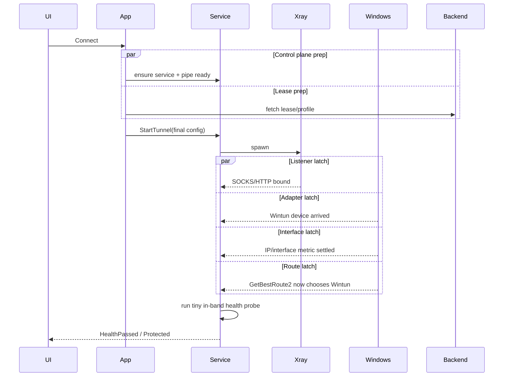
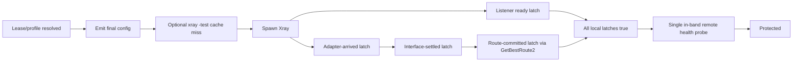

# Reducing DoodleRay TUN Connect Latency on Windows

## Executive summary

Your own phase breakdown points to an orchestration problem more than a protocol problem. The strongest evidence is that **system-proxy mode is already fast**, while **TUN mode averages roughly 15 seconds** and contains several fully serial waits, a synchronous backend lease fetch, repeated port checks, an external network probe, and a UI health loop with a **1.5 second polling cadence** before it will show “Protected.” fileciteturn0file0

The fastest path to a materially better result is to stop treating readiness as a single linear chain. In the current design, several post-spawn checks that are only loosely related are serialized, so you pay the sum of multiple waits rather than the maximum of the true dependency chain. The biggest near-term wins are: **parallelizing the post-spawn gates**, **replacing polling with Windows notifications**, **removing the external-IP “route preferred” probe from the route gate**, **making the service push readiness to the UI instead of the UI polling every 1.5 seconds**, **caching Xray `-test` by config hash**, and **overlapping the backend lease fetch with service/IPC readiness work**. Those changes can plausibly remove multiple seconds without weakening the “fail closed, not fake-green” requirement. fileciteturn0file0 citeturn7search0turn7search3turn7search5turn7search4turn8search2

Protocol tweaks are secondary. Xray’s own TLS documentation says session resumption is **disabled by default**, requires support on both ends, and “saves a tiny amount of handshake time” that is “usually negligible”; it also explicitly says this is **not TLS 0-RTT**. That makes it the wrong place to hunt for whole seconds. By contrast, WebSocket early data can remove one request/upgrade round trip on the WS path if that path is actually TLS+WS, and XHTTP over H3 is worth testing only if your path genuinely supports QUIC well. citeturn21view1turn22view0turn15search1

If I were handing this directly to your engineer, I would target **under 5 seconds first** with orchestration fixes, and view **2–3 seconds** as requiring at least one of: **persistent adapter reuse**, **speculative pre-work on server selection**, or both. On your current facts, the largest avoidable floor is not the REALITY/TLS handshake itself; it is the product of serial gating and coarse polling. fileciteturn0file0 citeturn26calculator0

## Dependency map of the current critical path

A few steps genuinely must stay sequential. If the final emitted config depends on the lease/profile from your backend, then **lease resolution must happen before the final config is written**, and **config write must happen before spawning Xray**. If you keep synchronous `xray run -test`, that test must happen before the spawn that uses the tested config. Those are real dependencies. Xray’s command documentation also confirms that `-test` validates config without launching the server, and `-dump` prints the merged config, which is useful both for caching and for verifying what you are really handing to Xray. fileciteturn0file0 citeturn24view1turn24view2

After the engine is spawned, however, several waits do **not** need to be serialized. Based on your phase description, **adapter appearance**, **SOCKS listener bind**, **HTTP listener bind**, **interface/address settlement**, and **route commitment** can be modeled as concurrent latches that begin immediately after spawn and resolve when their own prerequisites are met. In other words:  
- `5d` adapter arrival can start waiting immediately after spawn.  
- `5e` local listener readiness can also start immediately after spawn and does **not** need to wait for adapter arrival.  
- `5f` interface settlement depends on the adapter existing, but it does not depend on the local listeners.  
- `5g` route commitment depends on route/interface state, not on local listener binds if you replace the external probe with a local route-table proof.  
- `5h` looks redundant if it is checking the same local listeners already checked in `5e`; it should become a latched state, not a second gate. fileciteturn0file0

Your polling intervals themselves create a measurable latency tax even when the underlying work is already done. Using the intervals you provided, the average “quantization” delay from the listed polls is roughly **1.11 seconds** before counting the actual work they are waiting on, and the health loop is by far the biggest contributor because the UI only notices readiness on a 1.5 second boundary. fileciteturn0file0 citeturn26calculator0

Windows exposes the exact notification primitives needed to replace most of those polls. `CM_Register_Notification` can be used to receive PnP device-interface events; `NotifyIpInterfaceChange`, `NotifyUnicastIpAddressChange`, and `NotifyRouteChange2` provide callbacks for IP-interface, unicast-address, and route-table changes; and `GetBestRoute2` lets you ask the stack what route it would actually choose for a given destination. That means you can convert “sleep, poll, sleep, poll” into “subscribe once, then react the moment the OS changes state.” citeturn20view4turn20view3turn20view2turn7search1turn8search2

## Quick wins to implement first

1. **Turn post-spawn bring-up into concurrent readiness latches.**  
   **What to change:** After step `5c` spawns Xray, start four independent waiters immediately: `adapter_arrived`, `listeners_ready`, `interface_settled`, and `route_committed`. The service should mark tunnel state connected only when the required latches are all true, but the waits themselves should run concurrently. `5h` should be collapsed into the listener latch rather than re-checking the same condition later.  
   **Why it helps:** Your current sequencing pays for `d + e + f + g + h`; a latch model pays for roughly `max(d, e, f, g)` instead. That is the single biggest architectural correction available without changing protocol or safety semantics.  
   **Estimated impact:** **~0.5 to 2.5 seconds** depending on how much overlap exists on real machines.  
   **Risk and effort:** **Low to medium**. Mostly state-machine cleanup inside the service. fileciteturn0file0

2. **Replace readiness polling with Windows-native notifications everywhere you can.**  
   **What to change:** Use `CM_Register_Notification` for Wintun device/interface arrival, `NotifyUnicastIpAddressChange` for address assignment, `NotifyIpInterfaceChange` for interface metric/state change, and `NotifyRouteChange2` for route insertion/metric changes. Keep a bounded fallback poll only if a notification registration fails.  
   **Why it helps:** Your current 125/175/75/100 millisecond loops create avoidable jitter and average wait overhead. Notifications let the service react on the actual OS transition instead of the next poll boundary.  
   **Estimated impact:** **~0.2 to 0.6 seconds** on average from the OS-side polls alone, plus better tail latency on slower machines.  
   **Risk and effort:** **Medium**. You need robust callback registration, cancellation, and a compatibility fallback path. citeturn20view4turn20view3turn20view2turn7search4

3. **Stop using the external-IP probe as the route-preference gate.**  
   **What to change:** Replace step `5g` with a **local route proof**: call `GetBestRoute2` for one or more stable destinations you care about and verify that the chosen route’s interface LUID is the Wintun interface and that the chosen source address is the tunnel-side address. Where needed, also inspect interface and route metrics via `MIB_IPINTERFACE_ROW` and `MIB_IPFORWARD_ROW2`, because Windows route preference is the combination of route metric offset plus interface metric. Keep a **separate** tiny remote canary for “remote data plane is truly alive,” but do not use raw external routing I/O just to prove route commitment.  
   **Why it helps:** The current probe conflates two questions: “Has Windows committed the route?” and “Can the remote path carry traffic right now?” The first can be proven locally and instantly once route state is installed; the second should live in your health check. That preserves honesty while removing unnecessary RTT from the route gate.  
   **Estimated impact:** **~0.3 to 1.5 seconds**, depending on RTT and path conditions.  
   **Risk and effort:** **Medium**. You must define which destinations represent your routing policy under full-tunnel versus split-tunnel. fileciteturn0file0 citeturn8search2turn18search1turn18search4

4. **Make the service push readiness to the UI instead of making the UI poll every 1.5 seconds.**  
   **What to change:** Reuse the existing named-pipe control channel to deliver a push notification such as `RouteCommitted`, `HealthPassed`, and `Protected`. If you cannot do that immediately, replace the 1500 ms fixed cadence with a short-start exponential backoff such as `0, 50, 100, 200, 400, 800, 1000 ms`, returning as soon as health is acceptable.  
   **Why it helps:** Your UI currently rounds real readiness up to the next 1.5 second boundary, which is an enormous floor compared with every other poll in the system. This is one of the easiest places to win visible time without weakening verification.  
   **Estimated impact:** **~0.75 to 1.5 seconds on average** from the UI path alone.  
   **Risk and effort:** **Low** for a polling-backoff change, **medium** for a push-based state channel. fileciteturn0file0 citeturn26calculator0

5. **Cache Xray validation by final-config hash and Xray build identity.**  
   **What to change:** Compute a stable hash over the emitted final config bytes plus the Xray binary version or binary hash. If the exact same final config previously passed validation and then successfully spawned, skip `xray run -test` on reconnect. Invalidate the cache on Xray upgrade, app release changes to the config builder, protocol-mode changes, dynamic lease changes, or any differing emitted JSON.  
   **Why it helps:** Your own timing says the validation subprocess costs **~100–400 ms on every connect**. Xray’s docs confirm that `-test` exists to validate config only and does not launch the server. That makes it a strong candidate for a safe memoization strategy.  
   **Estimated impact:** **~0.1 to 0.4 seconds** per repeat connect.  
   **Risk and effort:** **Low** if you key the cache conservatively. fileciteturn0file0 citeturn24view1

6. **Overlap the backend lease/profile fetch with service startup and pipe readiness.**  
   **What to change:** On connect, begin the lease fetch and the service/IPC readiness work at the same time. There is no reason to wait for the HTTP round trip before ensuring the Windows service is running and its pipe is accepting requests. For managed servers, also consider speculative fetch on **server selection** if the lease TTL and issuance semantics allow it.  
   **Why it helps:** Step `4.5` is real network I/O and currently blocks before tunnel bring-up even starts. Even if final config generation must wait for the lease, the service-start and pipe-readiness work can run in parallel with that HTTP call.  
   **Estimated impact:** **~0.1 to 1.0 seconds typical**, potentially more when your backend API is slow.  
   **Risk and effort:** **Low to medium**. The main complexity is lease expiry, cancellation, and secure short-lived caching. fileciteturn0file0

7. **Fix the SCM-running versus named-pipe-ready race instead of retrying around it.**  
   **What to change:** Change the service lifecycle contract so that the service does not report itself fully running until its named pipe is bound and accepting connections, or expose a separate explicit “control plane ready” state that the client waits on once.  
   **Why it helps:** Your current `15 × 200 ms` retry loop exists specifically to paper over a startup race. Even if average impact is modest, it is needless tail latency and complexity.  
   **Estimated impact:** **Small average win, but up to 3 seconds of tail win** on cold starts or slower boxes.  
   **Risk and effort:** **Low** if you own both ends of the control plane. fileciteturn0file0

## Bigger structural rework with high payoff

8. **Reuse a persistent Wintun adapter rather than recreating it every connect.**  
   **What to change:** Keep one named adapter owned by the service across connect and disconnect cycles. On connect, prefer opening the existing adapter and starting a new session over creating a brand-new adapter object each time. Use a deterministic GUID so Windows networking identity is stable rather than randomized. On disconnect, remove routes, DNS, and packet session state, but keep the adapter object alive.  
   **Why it helps:** Wintun explicitly supports both creating a new adapter and opening an existing one, and its API notes that a requested GUID makes NLA generation deterministic, whereas a NULL GUID creates a new NLA entry each time. In your service-owned architecture, persistent adapter reuse fits the design and can remove part of the adapter-appearance and interface-settlement delay, especially on AV-heavy or policy-heavy machines.  
   **Estimated impact:** **~0.2 to 1.0 seconds**, sometimes more on troublesome field machines.  
   **Risk and effort:** **Medium to high** because disconnect cleanup must be perfect: no stale routes, no stale DNS, and no misleading residual state when “disconnected.” citeturn25view0turn25view1turn25view2

9. **Make readiness a single-source-of-truth inside the service and eliminate duplicate listener checks.**  
   **What to change:** Listener bind success should be recorded once by the service and exposed as an internal readiness latch. Do not perform `5e`, then later perform `5h`, if they are checking the same listeners. If a listener is only needed for control/debug and not for TUN data plane, do not force “Protected” to wait on it.  
   **Why it helps:** Duplicate checks rarely save you from real failures, but they do cost time and complicate state machines. Your phase list strongly suggests `5h` is defensive duplication rather than a fresh dependency.  
   **Estimated impact:** **~0.1 to 0.3 seconds** plus simpler failure handling.  
   **Risk and effort:** **Low**. fileciteturn0file0

10. **Pin XHTTP mode explicitly after measurement; do not trust undocumented defaults.**  
   **What to change:** For the XHTTP production path, emit an explicit `mode` once you confirm which mode matters in your environment. Test at least `stream-up` versus `packet-up` for your exact server/fronting setup, and only then standardize.  
   **Why it helps:** There is an important documentation mismatch here. Your description says that with no explicit mode, XHTTP effectively defaults to “stream-up” over likely H2. But the XHTTP maintainer discussion says that in `mode:"auto"` the client behavior is **TLS H2 → stream-up**, **REALITY → stream-one** unless `downloadSettings` is set, and otherwise `packet-up`; the same discussion also says `stream-up` tends to have better compatibility than `stream-one`. That means your current mental model of the default may be wrong for the REALITY path, and relying on default selection could be adding variability you do not realize.  
   **Estimated impact:** **Usually small on absolute connect time**—think **0 to 0.3 seconds**—but potentially meaningful for connect variance, compatibility, and first-flow performance.  
   **Risk and effort:** **Medium**, because the “best” mode is environment-specific. fileciteturn0file0 citeturn6view1turn5view0

11. **Treat QUIC H3 as an experiment, not a default, for XHTTP.**  
   **What to change:** If your server or edge stack truly supports QUIC well, run an A/B test with XHTTP ALPN pinned to only `h3` for a subset of nodes and compare cold-connect and first-traffic latency. Keep H2 as the default until you see real wins on real customer networks.  
   **Why it helps:** The XHTTP maintainer documentation says that with TLS/REALITY the client uses H2 by default, and if ALPN is only `h3`, the client uses H3. QUIC supports 0-RTT on resumed connections, avoids TCP head-of-line blocking, and can help on lossy paths, but the same XHTTP material also notes that H3 viability is environment-dependent and sometimes censored or impaired. This is worth testing, but it is not where I would spend my first implementation week.  
   **Estimated impact:** **Usually small for cold connect**, more useful for warm reconnects and unstable networks.  
   **Risk and effort:** **Medium** and highly path-dependent. citeturn5view3turn6view2turn15search1turn15search2

12. **Warm the right things before the user clicks, but do not pre-route traffic.**  
   **What to change:** Precompute and cache what is safe when a server is selected: generated config template, validation result for static parts, service readiness, optional lease prefetch if semantics permit, and optionally a persistent adapter handle. Do **not** pre-install routes or start a live TUN path that could divert traffic before the user clicks Connect.  
   **Why it helps:** This preserves your safety model while shifting work out of the button-path. It is a much cleaner target than fully pre-spawning a live Xray/TUN data plane, which would increase idle attack surface and complicate the definition of “disconnected.”  
   **Estimated impact:** **~0.3 to 1.5 seconds** if you combine config/validation/lease warm-up, more if service startup is often cold.  
   **Risk and effort:** **Medium** because of cache invalidation and credential lifetime handling. fileciteturn0file0

13. **Instrument field-phase timings and use AV exclusions only as a diagnostic, not as a core dependency.**  
   **What to change:** Emit monotonic timestamps for at least: service-ensure start, pipe-ready, lease request start/end, config-hash lookup, `-test` start/end, spawn, adapter arrival, first address set, first route change, `GetBestRoute2` success on tunnel LUID, first health success, and UI protected. Collect P50/P95/P99 by machine, OS build, and security stack. On enterprise fleets, add a support playbook for optional exclusions on the Xray binary/config directory and Wintun DLL, but only as an A/B diagnostic for outliers.  
   **Why it helps:** Microsoft’s own guidance on Defender exclusions makes clear that Defender performs real-time scanning of files and processes opened on the system, and exclusions change that behavior. That means AV can absolutely distort your startup path, but you should prove that per environment rather than make exclusions a product requirement. Instrumentation is what will tell you whether your bad tail is adapter settle, process spawn, backend lease latency, or endpoint security.  
   **Estimated impact:** **Indirect**, but essential for getting from “faster on dev boxes” to “faster in the field.”  
   **Risk and effort:** **Low** for instrumentation, **medium** for support policy around exclusions. citeturn11search0turn11search4

## Protocol-specific conclusions for VLESS, REALITY, XHTTP, and WS

The first protocol conclusion is that **Xray’s own TLS session resumption is not a major connect-latency lever**. The docs say it is disabled by default, requires both sides to enable it, and usually saves only a tiny amount of handshake time because certificates need not be retransmitted; they also say it is **not TLS 0-RTT** and does **not** reduce handshake RTT. So if you enable it on any pure TLS path, do it as a cleanup optimization, not as the headline fix. citeturn21view1

The second conclusion is that your **WS path needs an effective-config audit before tuning**. Current Xray transport docs say REALITY is valid only with `RAW`, `XHTTP`, and `gRPC`, while `WebSocket` is documented under TLS transports instead. That directly conflicts with your description of a `VLESS + Reality + WS` production variant. Before giving protocol advice to engineering, I would use `xray run -dump` on the exact emitted runtime config and confirm whether that profile is actually `security:"tls"` + `method:"websocket"` or something else produced by your config generator. If the effective path is in fact **TLS+WS**, then WS early data is a real option: Xray documents `?ed=2560` in the path as enabling early data via `Sec-WebSocket-Protocol`, specifically to reduce latency. If the dumped config really is **REALITY+WS**, treat that as a compatibility/documentation mismatch to resolve first. fileciteturn0file0 citeturn23view1turn22view0turn24view2

For the XHTTP path, I would not assume the current default mode is what you think it is. The maintainer discussion states that `auto` behaves differently for TLS-H2 and REALITY, and also notes that `stream-up` generally has better compatibility than `stream-one`. That means the most practical protocol-level optimization here is **not** “turn on resumption”; it is “pin the exact XHTTP mode that actually performs best in your deployment and stop allowing default selection to vary by transport/security combination.” citeturn6view1turn5view0

On uTLS fingerprints, Xray’s TLS docs explicitly say the `fingerprint` setting only simulates the **TLS ClientHello** and that behavior and other fingerprints remain the same as Go. They also explain that ALPN handling is special: for most transports the common `h2,http/1.1` ALPN is forced by default, while for WebSocket the default is `http/1.1`. That strongly suggests the `chrome` uTLS fingerprint is **not** where your multi-second delay is hiding; it is mostly a fingerprinting decision, not a whole-connection acceleration feature. citeturn21view1turn21view2

## Method and the most useful sources

I treated your uploaded description as the ground-truth description of the current implementation and timing model, then checked it against official Xray documentation, Microsoft IP Helper and PnP notification APIs, Wintun and WireGuard Windows primary sources, and the TLS/QUIC standards where protocol behavior mattered. I do **not** have your repository, so wherever your description and current official Xray docs disagree, I call that out explicitly rather than pretending certainty. fileciteturn0file0 citeturn23view1turn24view2

| Priority | Source | Why it mattered |
|---|---|---|
| High | Your uploaded architecture and phase breakdown fileciteturn0file0 | This is the authoritative source for current behavior, sequencing, poll intervals, constraints, and targets. |
| High | Xray transport configuration docs citeturn23view1 | Establishes what transport/security combinations are officially valid, including the REALITY-versus-WebSocket mismatch. |
| High | Xray TLS docs citeturn21view1turn21view2 | Confirms session-resumption semantics, fingerprint behavior, and ALPN handling; critical for ruling out “TLS tweak” fantasies. |
| High | Xray WebSocket docs citeturn22view0turn22view2 | Documents WS early data and heartbeat behavior. |
| High | XHTTP maintainer discussion citeturn5view0turn6view1turn6view2 | The only source here that explains current XHTTP mode behavior and H2/H3 selection detail in a way useful for engineering. |
| High | Xray command docs citeturn24view1turn24view2 | Validates how to use `-test` and `-dump` for caching and runtime-config verification. |
| High | Microsoft IP Helper and PnP notification APIs citeturn20view4turn20view3turn20view2turn7search4turn8search2 | These are the primary sources for replacing polls with event-driven readiness and for implementing local route proofs. |
| Medium | Microsoft route/interface metric docs citeturn18search1turn18search4 | Necessary to make the route-proof logic honest rather than heuristic. |
| Medium | Wintun API header and official site citeturn25view0turn25view1turn25view2turn9search10 | Proves that persistent adapter reuse and deterministic GUIDs are viable in the underlying driver API. |
| Medium | WireGuard for Windows official enterprise docs citeturn17search0turn19view3 | Relevant prior art for a Windows-service-owned tunnel model and secure UI/service separation. |
| Medium | TLS 1.3 and QUIC 0-RTT standards citeturn15search0turn15search1turn15search2 | Useful for separating warm-resume protocol benefits from cold-connect reality. |

## Suggested hand-off visuals for engineering

A sequence diagram is worth creating because your main problem is dependency shape, not any single slow API. The first diagram should show the **current** serial path and the **proposed** concurrent-latch path side by side. The second should show the **service state machine** that ends in `Protected` only after both local-route proof and remote health success are true. Those diagrams will make it much easier to keep the “fail closed” guarantee while deleting avoidable waits. fileciteturn0file0

A second useful diagram is a dependency graph that explicitly marks which steps must remain sequential and which can run in parallel:

The short version, if you want the bluntest possible engineering priority order, is this: **parallelize after spawn, replace polls with notifications, demote the external route probe, push health to the UI, cache `-test`, overlap the lease fetch, then look at persistent adapter reuse.** That is where your seconds are. The protocol layer is mostly cleanup after that, not the main event. fileciteturn0file0 citeturn21view1turn22view0